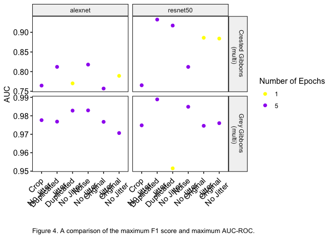
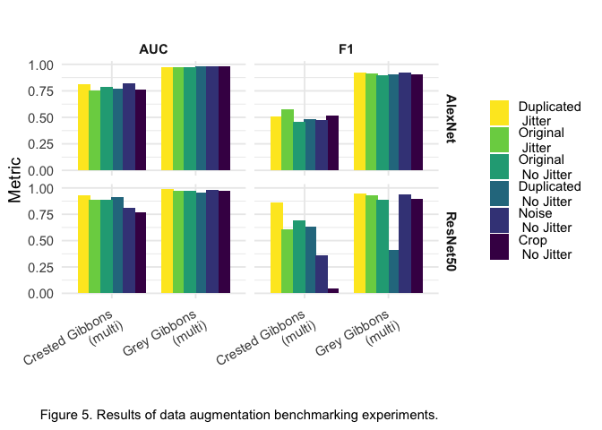
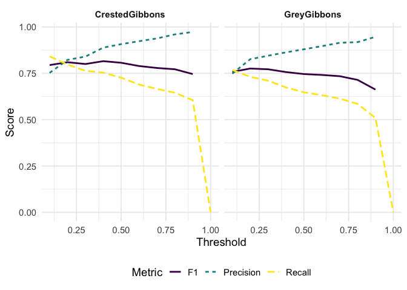
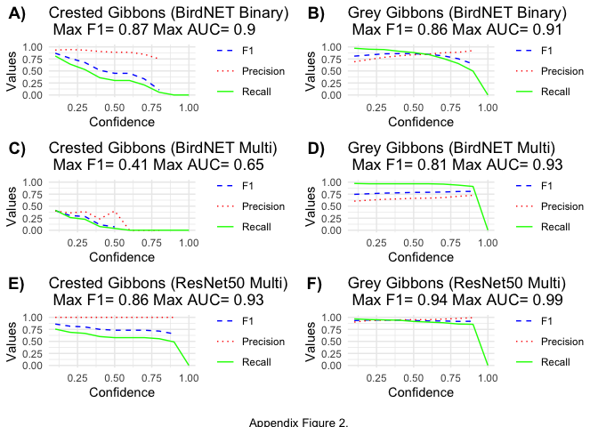

Recreate R scripts for torch-for-R-gibbons manuscript
================
Clink et al. 2025

### Figure 4.

<!-- -->

### Figure 5.

<!-- -->

# Table 4.

A comparison AlexNet and ResNet50 architecture performance to that of
BirdNET binary and multiclass models. The table shows the maximum F1
score, precision, recall, threshold, and AUC for each model
configuration. The best performing model for each species as determined
by AUC-ROC is indicated in bold.

# Figure 6.

<!-- -->

# Appendix Figure 2

<!-- -->
