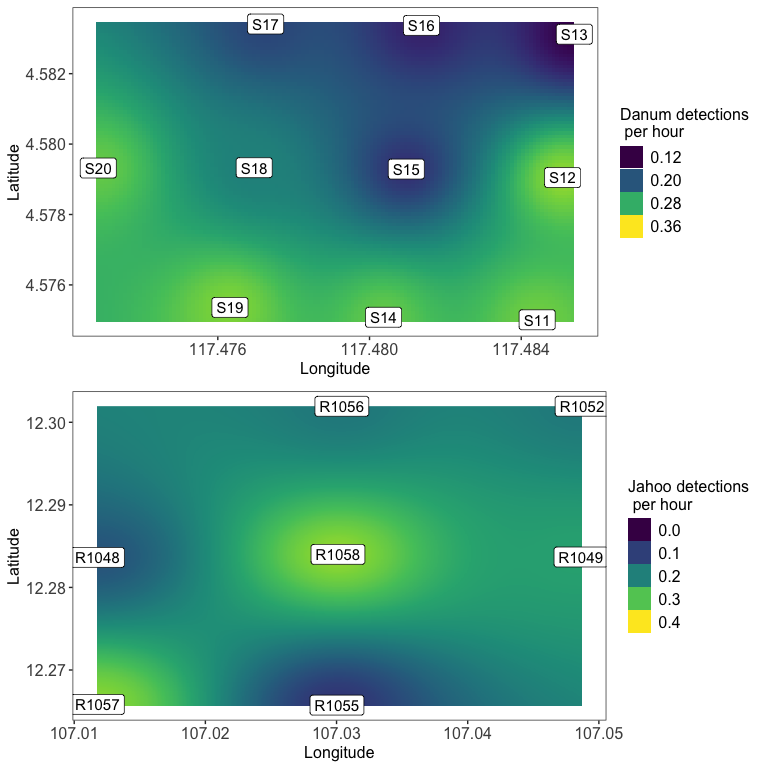

Recreate Figures for torch-for-R-gibbons manuscript
================
Clink et al. 2025

# Recreate figures and tables in manuscript

Current citation: Clink, Dena J., et al. “Automated detection of gibbon
calls from passive acoustic monitoring data using convolutional neural
networks in the” torch for R” ecosystem.” arXiv preprint
arXiv:2407.09976 (2024).

<!-- -->

### Figure 4.

A comparison of the maximum F1 score +/- standard error (A) and maximum
AUC-ROC +/- standard error (B) over three replicate model runs for each
of the model architectures in our analysis. The x-axis indicates the CNN
architecture, and the color indicates whether the model feature
extractor was fine-tuned (purple) or not (orange). The y-axis indicates
the value for each metric. Note the variation in y-axis range for each
data type.  
Script: Part 3b. Evaluation data augmentation.R

<!-- -->

### Figure 5.

Results of data augmentation benchmarking experiments for multiclass
models on test datasets from Maliau Basin Conservation Area, Malaysia
(grey gibbons) and Dakrong Nature Reserve, Vietnam (crested gibbons).
The metrics show the highest AUC-ROC and maximum F1-score for each type
of data augmentation approach for both AlexNet and ResNet50
architectures.  
Script: Part 3c. Evaluation data augmentation on different test set.R

### Table 4.

A comparison AlexNet and ResNet50 architecture performance to that of
BirdNET binary and multiclass models. The table shows the maximum F1
score, precision, recall, threshold, and AUC for each model
configuration. The best performing model for each species as determined
by AUC-ROC is indicated in bold.  
Script: Part 4b. Comparison with BirdNET.R

| Species        | Model          | Max_F1 | Precision | Recall | Threshold |  AUC |
|:---------------|:---------------|-------:|----------:|-------:|----------:|-----:|
| Crested Gibbon | ResNet50 Multi |   0.86 |      1.00 |   0.76 |       0.1 | 0.93 |
| Crested Gibbon | BirdNET Binary |   0.87 |      0.93 |   0.81 |       0.1 | 0.90 |
| Crested Gibbon | BirdNET Multi  |   0.41 |      0.40 |   0.42 |       0.1 | 0.65 |
| Grey Gibbon    | AlexNet Multi  |   0.94 |      0.94 |   0.95 |       0.2 | 0.99 |
| Grey Gibbon    | BirdNET Multi  |   0.81 |      0.73 |   0.91 |       0.9 | 0.93 |
| Grey Gibbon    | BirdNET Binary |   0.86 |      0.81 |   0.91 |       0.4 | 0.91 |

### Table 6.

Model performance for test files from wide arrays at Danum Valley
Conservation Area, Malaysia, and Jahoo, Cambodia. Models were multiclass
ResNet50 architecture trained on the “duplicated” dataset with color
jitter. AUC-ROC is shown once for each class as it is threshold
independent.

Script: Part 5. Final model performance.R

| Type           | Class          | CNN.Architecture |   F1 |  AUC | Threshold | Precision | Recall |   FPR |
|:---------------|:---------------|:-----------------|-----:|-----:|----------:|----------:|-------:|------:|
| Best F1        | CrestedGibbons | 5_resnet50_model | 0.82 | 0.95 |       0.4 |      0.89 |   0.75 | 0.005 |
| Best F1        | GreyGibbons    | 5_resnet50_model | 0.78 | 0.93 |       0.2 |      0.83 |   0.73 | 0.020 |
| Best Precision | CrestedGibbons | 5_resnet50_model | 0.75 | 0.95 |       0.9 |      0.97 |   0.60 | 0.001 |
| Best Precision | GreyGibbons    | 5_resnet50_model | 0.66 | 0.93 |       0.9 |      0.95 |   0.51 | 0.004 |
| Best Recall    | CrestedGibbons | 5_resnet50_model | 0.79 | 0.95 |       0.1 |      0.75 |   0.84 | 0.014 |
| Best Recall    | GreyGibbons    | 5_resnet50_model | 0.76 | 0.93 |       0.1 |      0.75 |   0.77 | 0.034 |

<!-- -->

### Figure 6.

Precision, recall, and F1 score as a function of confidence score for
test datasets from the wide array for crested and grey gibbons. Models
used were multiclass ResNet50 architecture trained on the “duplicated”
dataset with color jitter.

Script: Part 5. Final model performance.R

<!-- -->

### Figure 7. Call event density

Call event density for Danum Valley Conservation Area, Malaysia (top)
and Jahoo, Cambodia (bottom). Recorders were placed at ~750-m spacing in
Danum Valley and ~2-km at Jahoo. The number of detections was
standardized by the number of recording hours at each recorder location.

Script: Part 7. Call Density Plots.R

### Appendix Figure 1

Script: Part 3b. Evaluation data augmentation.R
<!-- -->

### Appendix Figure 2

Script: Part 4b. Comparison with BirdNET.R
<!-- -->
